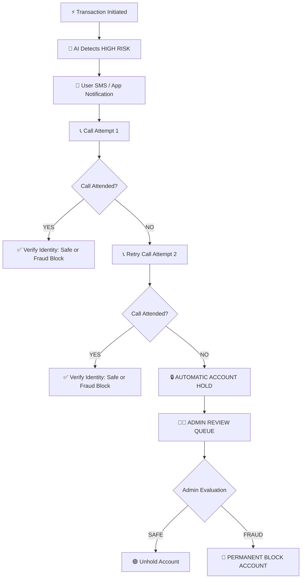

# FraudGuard AI
### *Detect. Analyze. Protect.*
> **AI-Powered Fraud Detection, Automated Customer Call Verification & Account Protection Platform**  
> *Built for 24-Hour Student Hackathon 2026*

---

## 📌 Project Overview
**FraudGuard AI** is an enterprise-grade financial security and fraud surveillance system engineered to detect suspicious transactions in real time. Built with a custom **Emerald Green & Cobalt Blue** rectangular visual identity (strict avoidance of generic AI templates, capsule/pill badges, or floating cards), it combines **calibrated heuristic rule scoring**, **unsupervised Machine Learning (Isolation Forest)**, and **automated customer communication & account lockdown workflows** to safeguard financial institutions.

---

## 🔄 Automated Customer Call & Account Protection Workflow



---

## 🎯 Key Features

- **Emerald Green & Cobalt Blue Design Theme**:
  - High-contrast visual identity using deep charcoal navy (`#071224`, `#0B192C`), emerald green (`#10B981`), and royal cobalt blue (`#1D4ED8`).
  - Strict **No-Pill / No-Capsule UI Policy**: Clean 4px–8px rectangular borders for tables, badges, cards, and buttons.
- **Automated Customer Call & SMS Verification Flow**:
  - Immediate SMS / app notification when high risk (>60) is detected.
  - Interactive multi-step phone call simulation with real-time status logging.
  - Automated **Account Hold** after 2 missed call attempts.
  - Dedicated **Admin Review Portal** with 1-click **SAFE (Unhold)** or **FRAUD (Block Account)** actions.
- **Hybrid Machine Learning & Anomaly Scoring**:
  - **Isolation Forest Model** (`ml_model.py`): 120-tree unsupervised outlier detection trained on transaction velocity, amount multiplier, device shifts, and geographical deviation.
  - **Rule-Based Engine** (`fraud_detection.py`): Amount anomalies, unknown devices, out-of-region coordinates, late-night spikes, and velocity bursts.
  - **Explainable AI (XAI)**: Numbered evidence reasons (`01`, `02`, `03`...) explaining exactly why an alert was triggered.
- **Interactive Pitch Deck & PowerPoint**:
  - In-browser 10-slide presentation at `/presentation` with keyboard shortcuts.
  - Exportable 10-slide PowerPoint file (`FraudGuard_AI_Presentation.pptx`).
- **Interactive Canvas Network Graph**:
  - Physics-based transaction graph mapping transfers and detecting money mule rings.
- **Batch CSV Processing**:
  - Upload batch transaction datasets, execute real-time scoring, and export downloadable forensic reports.

---

## 🛠️ Technology Stack

- **Backend**: Python 3.10+, Flask 3.1, SQLite3
- **Machine Learning**: Scikit-Learn (Isolation Forest), Pandas, NumPy, Joblib
- **Frontend**: Handcrafted Semantic HTML5, CSS3 (Green & Blue palette), Vanilla JavaScript ES6
- **Charts & Visuals**: Chart.js 4.4, HTML5 Canvas Network Physics, Lucide Icons
- **Presentation**: `python-pptx`, In-Browser Slide Deck

---

## 🏗️ Risk Calculation Formula

$$\text{Final Risk Score} = \text{round}\Big(0.60 \times \text{Rule Score} + 0.40 \times \text{ML Anomaly Score}\Big)$$

| Risk Level | Score Range | Classification | Theme Color | Automated Action |
|---|---|---|---|---|
| **LOW** | 0 – 30 | Normal | 🟢 Emerald Green | Auto Approved |
| **MEDIUM** | 31 – 60 | Review | 🟡 Amber | Secondary MFA |
| **HIGH** | 61 – 80 | Suspicious | 🟠 Orange | 📱 SMS + 📞 Call Verification |
| **CRITICAL** | 81 – 100 | Critical Threat | 🔴 Red | Immediate Call & Account Lockdown |

---

## 🌐 Application Routes & API Endpoints

### User & Admin Views
- `/` — Public Landing Page & Feature Architecture
- `/login` — Secure Analyst Authentication Portal
- `/dashboard` — Security Overview, Charts & Live Attack Simulator
- `/transactions` — Real-Time Transaction Monitoring & Ledger
- `/transactions/<id>` — Deep-Dive Investigation & Explainable AI
- `/accounts` — Account Behavioral Profiling Directory & Surveillance
- `/accounts/<id>` — Account Baseline & Ledger
- `/analytics` — 6 Chart.js Forensic Intelligence Panels
- `/alerts` — Incident Triage Feed
- `/upload` — Batch CSV Ingestion & Report Export
- `/settings` — Model Calibration & Risk Thresholds
- `/presentation` — 10-Slide Hackathon Pitch Deck

### REST API Endpoints
- `POST /api/simulate` — Trigger attack simulation with 6-stage telemetry
- `POST /api/accounts/<id>/call-step` — Execute Call Attempt 1 / Call Attempt 2 / Hold
- `POST /api/accounts/<id>/admin-review` — Admin decision (SAFE unhold vs FRAUD block)
- `POST /api/upload` — Batch CSV ingestion
- `GET /api/analytics` — Chart.js analytical aggregates
- `GET /api/network` — Transaction graph nodes and edges
- `GET /download-ppt` — Download presentation (`.pptx`)

---

## ⚡ Quick Start & Installation

### 1. Clone the Repository
```bash
git clone https://github.com/mahilanarjunan04-lang/Fraud-GuardAI.git
cd Fraud-GuardAI
```

### 2. Install Dependencies
```bash
pip install -r requirements.txt
```

### 3. Initialize & Seed Database
```bash
python seed_data.py
```

### 4. Run Application Server
```bash
python app.py
```

Open your browser at: **`http://127.0.0.1:5000`**

---

## 🔑 Demo Credentials

- **Email**: `admin@fraudguard.ai`
- **Password**: `admin123`

---

## 🎬 24-Hour Hackathon Jury Demonstration Flow

1. **Sign In**: Navigate to `http://127.0.0.1:5000/login` (`admin@fraudguard.ai` / `admin123`).
2. **Dashboard Overview**: Review the Green & Blue dashboard metrics, Risk Landscape doughnut chart, and activity trends.
3. **Simulate Live Threat**: Click **[ Simulate Transaction ]** on the dashboard to watch the 6-stage telemetry detection pipeline.
4. **Interactive Call Verification**: Click **[ Call Customer & Verify ]** on a flagged high-risk account.
   - Test **Call Attempt 1** (Attended vs Not Attended).
   - If not attended, trigger **Call Attempt 2 (Retry)**.
   - If second attempt fails, see the account status immediately shift to **`ACCOUNT_HOLD`**.
5. **Admin Review Portal**: Click **[ Review Account ]** to open the Admin Portal and select **SAFE (Unhold)** or **FRAUD (Block Account)**.
6. **Network Graph**: Explore the interactive HTML5 Canvas node graph on the Dashboard.
7. **CSV Batch Upload**: Navigate to `/upload`, click **[ Generate Sample CSV ]**, upload and download the audited report.
8. **Pitch Deck**: Click **Pitch Deck** in the top navigation (or `/presentation`) to present the project to judges.
